# lab report 3

## task1

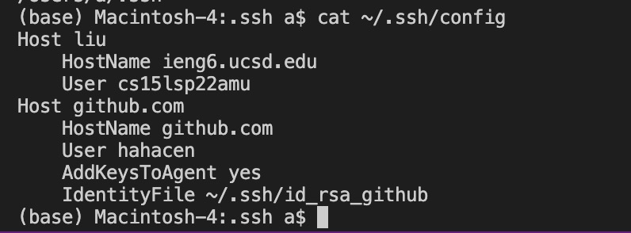
 
we use this to  edit the file ```(base) Macintosh-4:.ssh a$ vi ~/.ssh/config ```

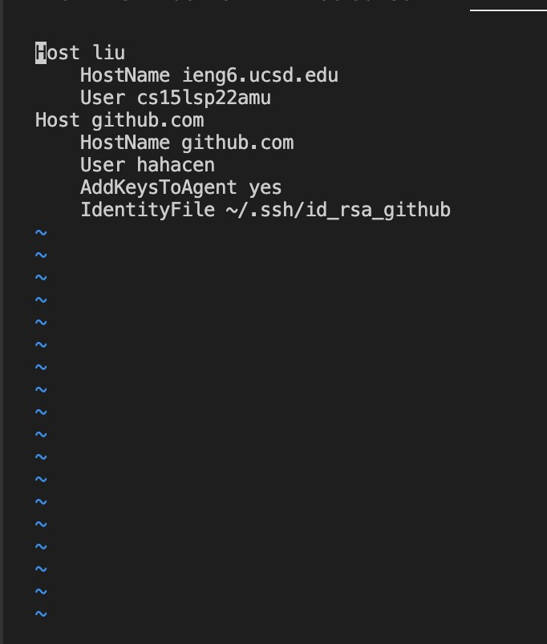

we copy and paste the following to from lab 5 write up
```
    HostName ieng6.ucsd.edu
    User cs15lsp22zzz (use your username)
```

we type ``` ssh liu``` replacing the old ```cs15lsp22amu@ieng6.ucsd.edu```
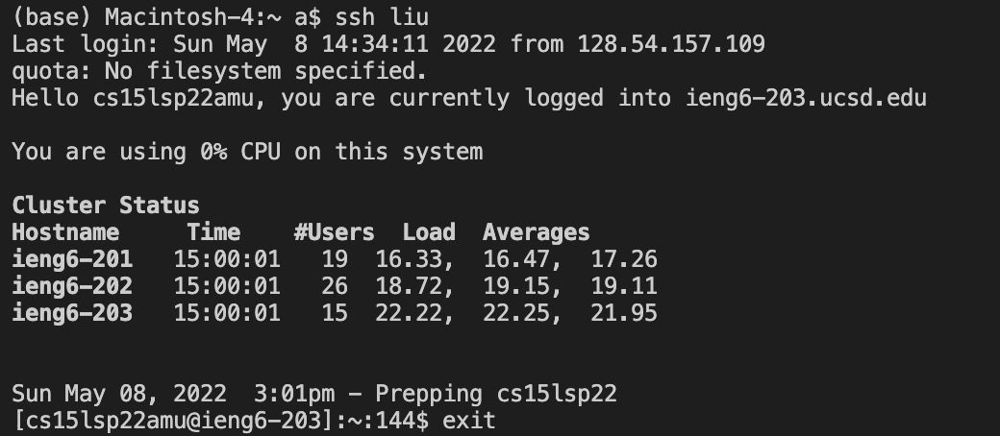

then I use scp to move the new file created to the remote server: 

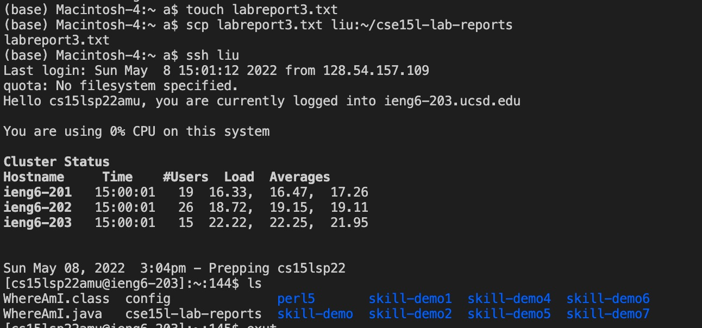

## task 2
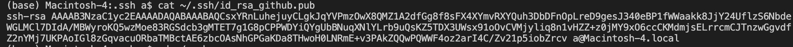
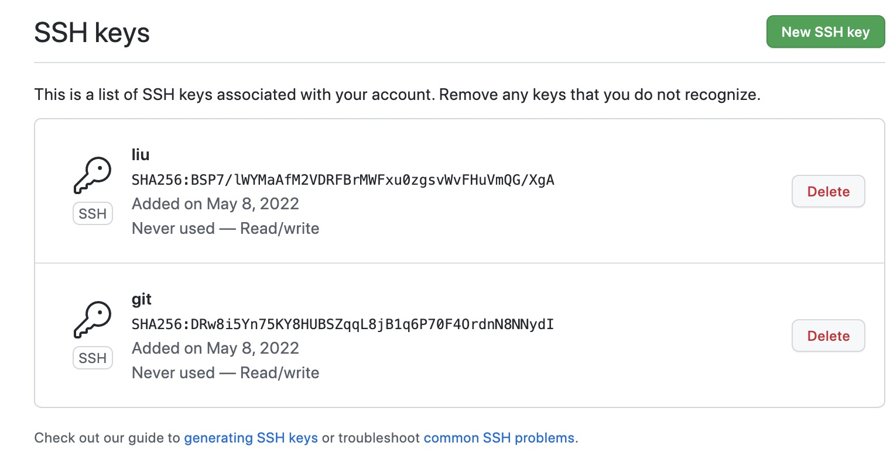

here we create the public ssh key on github
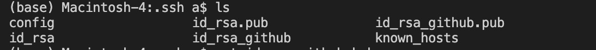

this is the public and private key
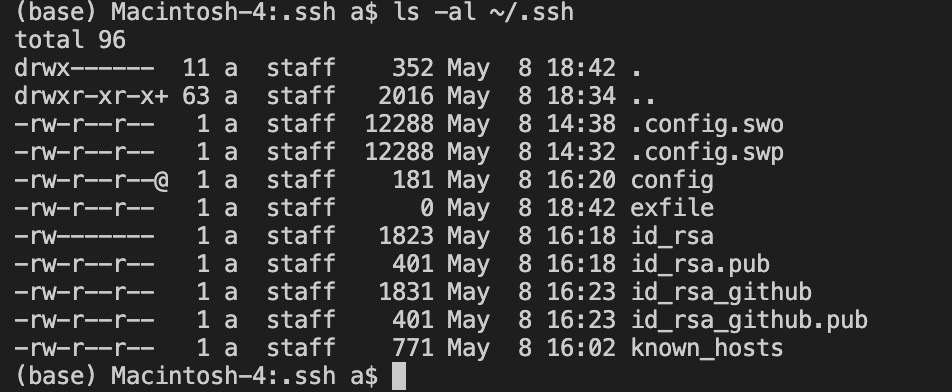

run and commit on ieng6 server:
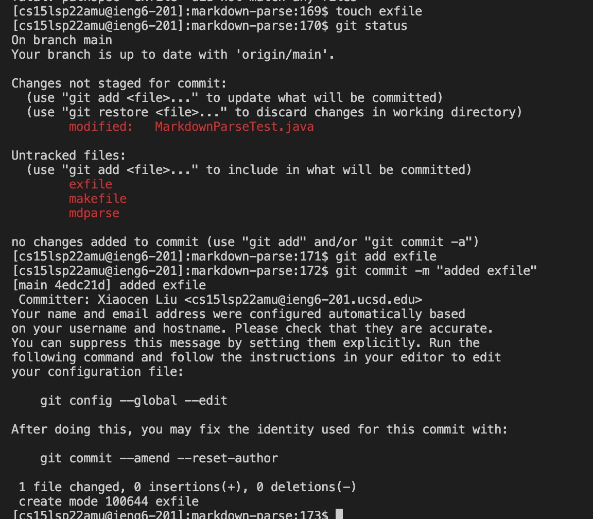

## task 3
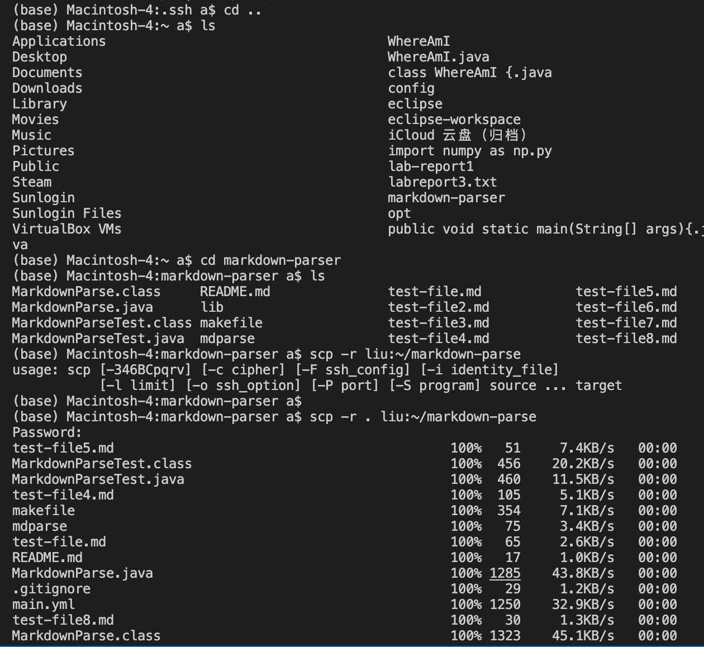

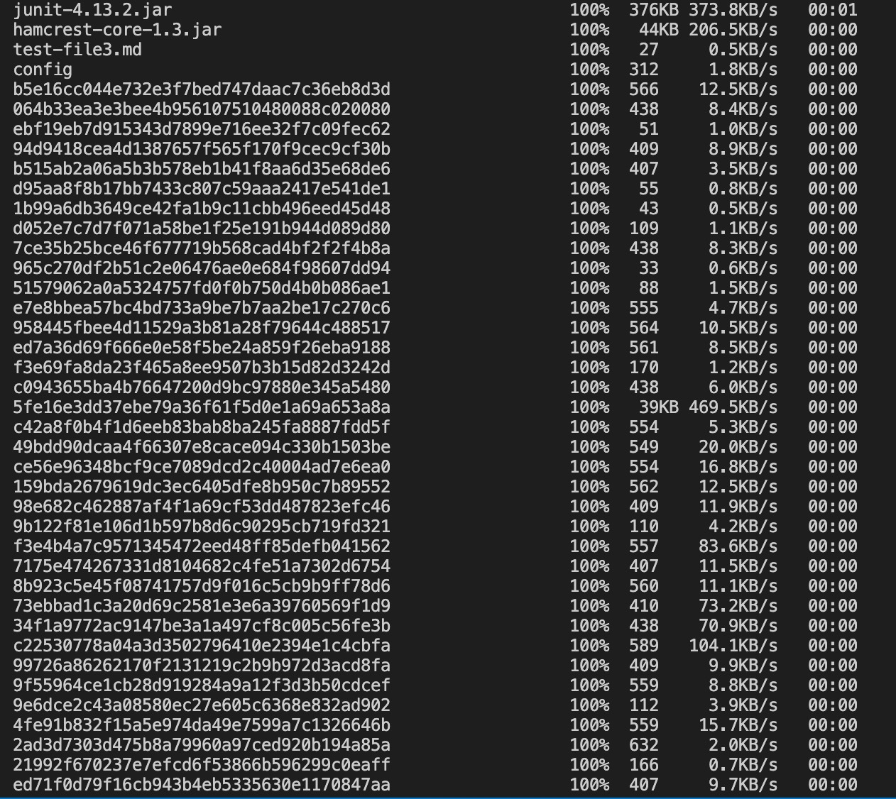
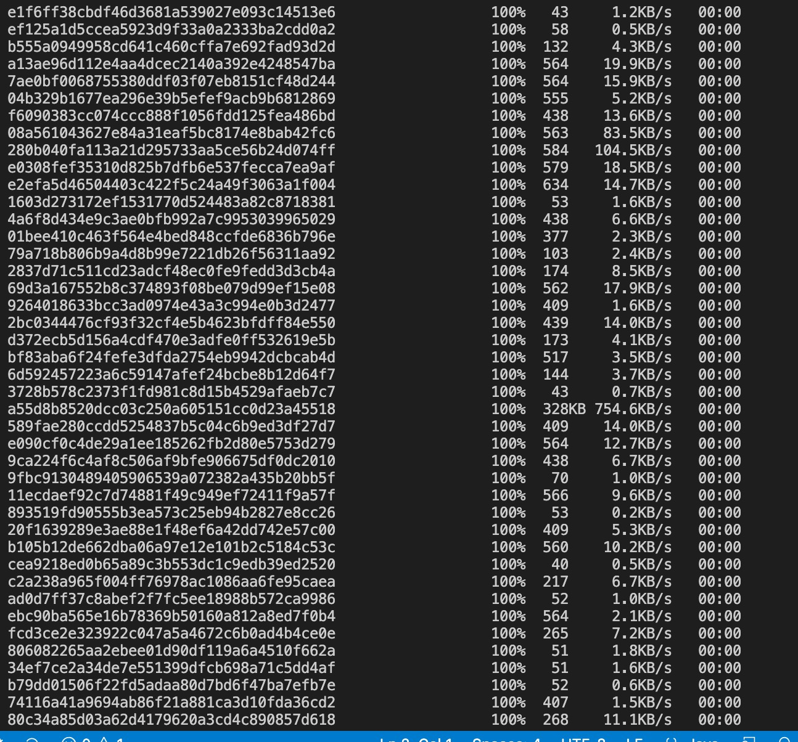
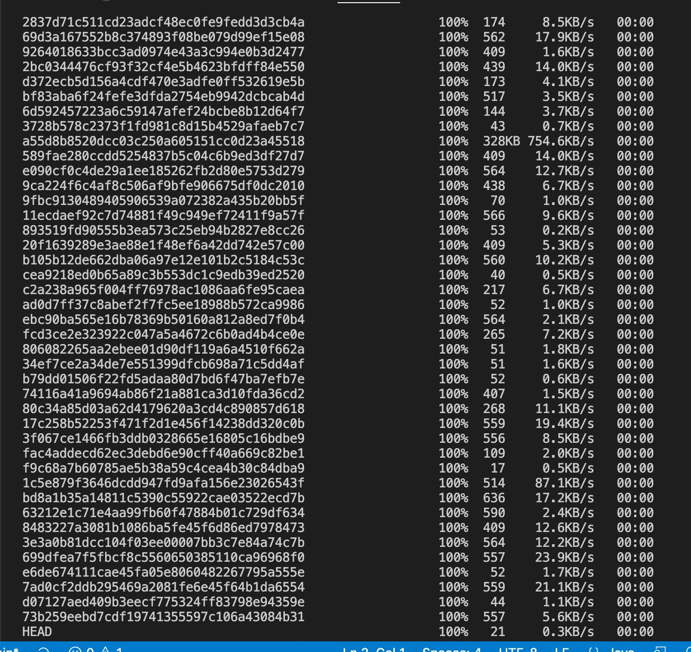
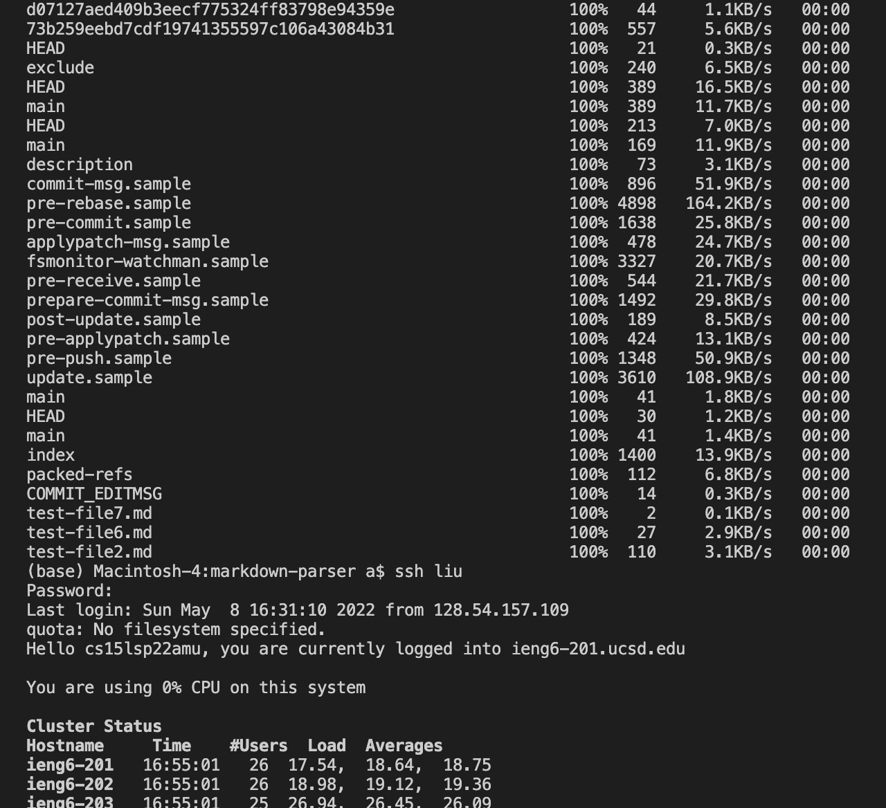
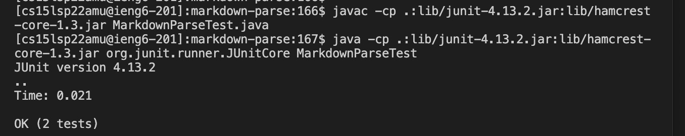

```
scp -r . liu:~/markdown-parser; ssh cse "cd /home/linux/ieng6/cs15lsp22/cs15lsp22anq/markdown-parser/; javac -cp .:lib/junit-4.13.2.jar:lib/hamcrest-core-1.3.jar MarkdownParseTest.java; java -cp lib/junit-4.12.jar:lib/hamcrest-core-1.3.jar:. org.junit.runner.JUnitCore MarkdownParseTest"
```

we will use this combined code 

