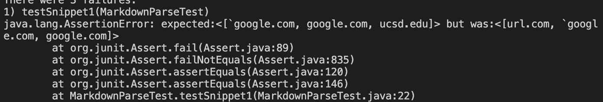
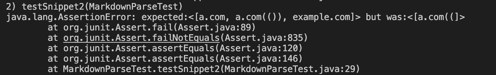
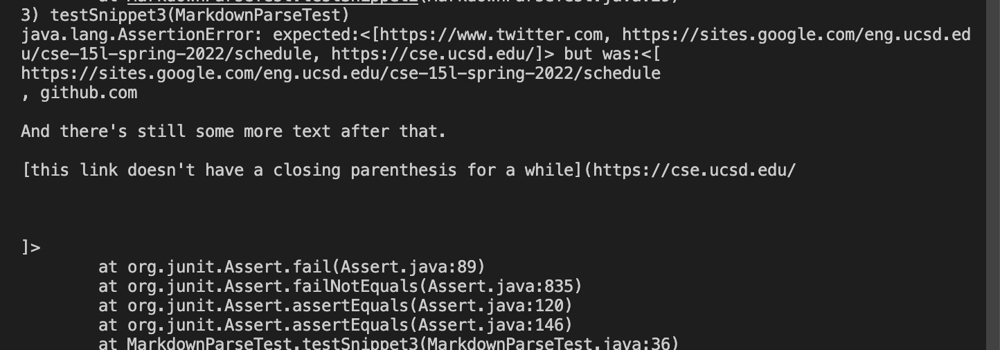

- the [link](https://github.com/hahacen/markdown-parser) to MarkdownParse repository
- the [link](https://github.com/MichaelYe48/markdown-parser) to my peer's 

## Snippet1:

this is the expected:

```[`google.com, google.com, ucsd.edu]```


this is the test code
```
 @Test
    public void testSnippet1() throws IOException{
        Path fileName=Path.of("/Users/a/Documents/GitHub/markdown-parser/Snippet1.md");
        String content = Files.readString(fileName);
        List<String> expected= List.of("google.com","google.com", "ucsd.edu");
        assertEquals(expected,mark.getLinks(content));
    }
```
this is my output


this is my peer's :


## Snippet2:
 this is the expected:
 ```[a.com, a.com(()), example.com]```

this is my test code:
```
    @Test
    public void testSnippet2() throws IOException{
        Path fileName=Path.of("/Users/a/Documents/GitHub/markdown-parser/Snippet2.md");
        String content = Files.readString(fileName);
        List<String> expected= List.of("a.com","a.com(())", "example.com");
        assertEquals(expected,mark.getLinks(content));

}
```
my output:


this is my peer's

## Snippet 3:

this is the expected output:
```[https://www.twitter.com, https://sites.google.com/eng.ucsd.edu/cse-15l-spring-2022/schedule, https://cse.ucsd.edu/]```

```
@Test
    public void testSnippet3() throws IOException{
        Path fileName=Path.of("/Users/a/Documents/GitHub/markdown-parser/Snippet3.md");
        String content = Files.readString(fileName);
        List<String> expected= List.of("https://www.twitter.com"," https://sites.google.com/eng.ucsd.edu/cse-15l-spring-2022/schedule"," https://cse.ucsd.edu/");
        assertEquals(expected,mark.getLinks(content));

}
```
my output:


my peer's:

