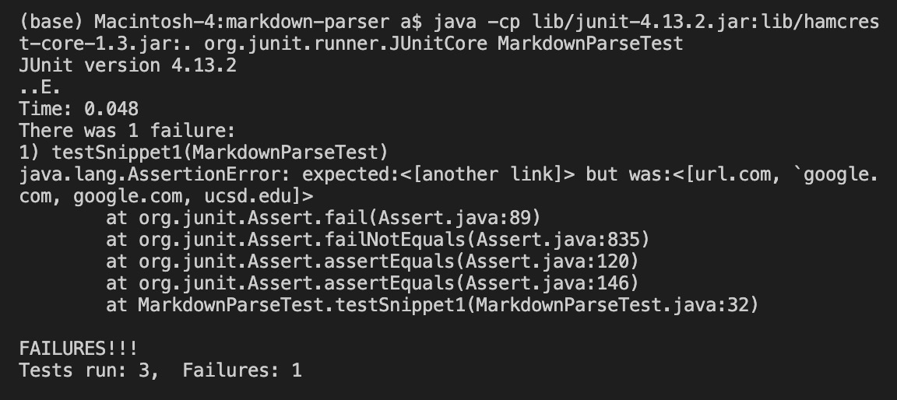
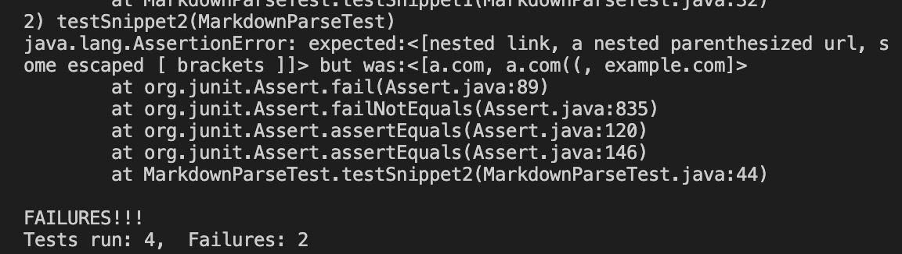

- the [link](https://github.com/hahacen/markdown-parser) to MarkdownParse repository
- the [link](https://github.com/MichaelYe48/markdown-parser) to my peer's 

## Snippet1:

this is the expected:

```[another link]```


this is the test code
```
 @Test
    public void testSnippet1() throws IOException{
        Path fileName=Path.of("/Users/a/Documents/GitHub/markdown-parser/Snippet1.md");
        String content = Files.readString(fileName);
        ArrayList<String> expected= new ArrayList<>();
        expected.add("another link");
        assertEquals(expected,mark.getLinks(content));
    }
```
this is my output


this is my peer's :

## Snippet2:
 this is the expected:
 ```[nested link, a nested parenthesized url, some escaped [ brackets ]]```

this is my test code:
```
    @Test
    public void testSnippet2() throws IOException{
        Path fileName=Path.of("/Users/a/Documents/GitHub/markdown-parser/Snippet2.md");
        String content = Files.readString(fileName);
        ArrayList<String> expected= new ArrayList<>();
        expected.add("nested link");
        expected.add("a nested parenthesized url");
        expected.add("some escaped [ brackets ]");

        assertEquals(expected,mark.getLinks(content));

}
```
my output:


this is my peer's

```
@Test
    public void testSnippet3() throws IOException{
        Path fileName=Path.of("/Users/a/Documents/GitHub/markdown-parser/Snippet3.md");
        String content = Files.readString(fileName);
        ArrayList<String> expected= new ArrayList<>();
        expected.add("[this title text is really long and takes up more than one line]");
        assertEquals(expected,mark.getLinks(content));

}
```