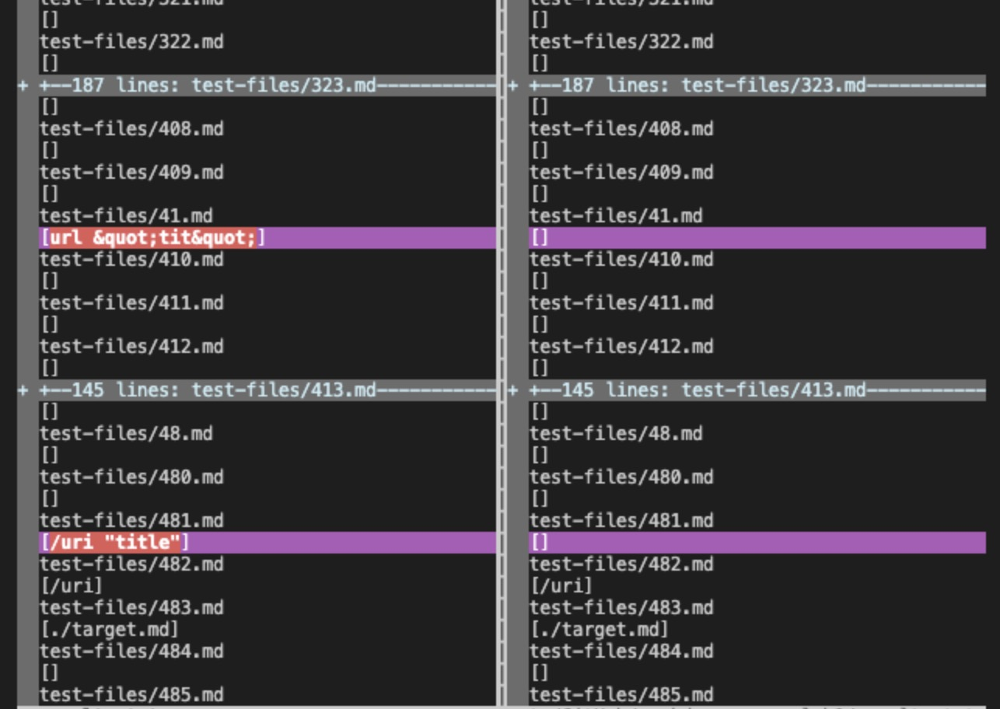
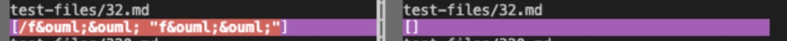
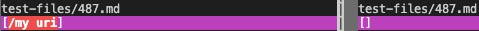

## Week 10 lab report

### Task 1:
How you found the tests with different results (Did you use vimdiff on the results of running a bash for loop? Did you search through manually? Did you use some other programmatic idea?)

I chose two different tests that have a different output with my implementation and the course implementation. 

Through ```vimfiff``` command, I was able to find the tests that have different output. This has the following steps:
1. store the outuput of running the course implementation onto a new file called ```result.txt```, using the code```bash script.sh > result.txt```
2. then store the output of my implementation into a new file called ```myresult.txt```, using the code ```bash script.sh > myresult.txt```
3. use ```vimfiff```, then we can comapre the two files, then we can find the differences


this is the difference:



### Task 2:
Provide a link to the test-file with different-results (in the provided repository or your repository , either is fine)

[link1](https://github.com/hahacen/markdown-parser/blob/main/test-files/32.html.test)

[link2](https://github.com/hahacen/markdown-parser/blob/main/test-files/481.html.test)


### Task 3:

For each test:

Describe which implementation is correct, or neither if both give the wrong output

For the first test, the implementation provided for lab 9 is wrong as compared to the expected output, and mine is correct. 

For the second test, the implementationprovided for lab 9 is also correct, and mine is wrong.

Indicate both actual outputs (provide screenshots) and also what the expected output is (list the links that are expected in the output).

for the first #32 test:

the expected output should be 

```/f&ouml;&ouml; "f&ouml;&ouml;"```

the actual output is 


the left output is mine, and right is the course implementation

and I will examine through the course implementation

for the second #487 test

the expected output should be
```[]```

the actual is 



for the first mistake, I will examine through the my implementation:
### Task 4:

For the implementation that’s not correct (or choose one if both are incorrect), describe the bug (the problem in the code) in about 2-3 sentences. You don’t have to provide a fix, but you should be specific about what is wrong with the program, and show the code that should be fixed (Provide a screenshot of code and highlight where the change needs to be made).

#### for the #32:


