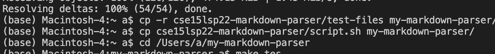
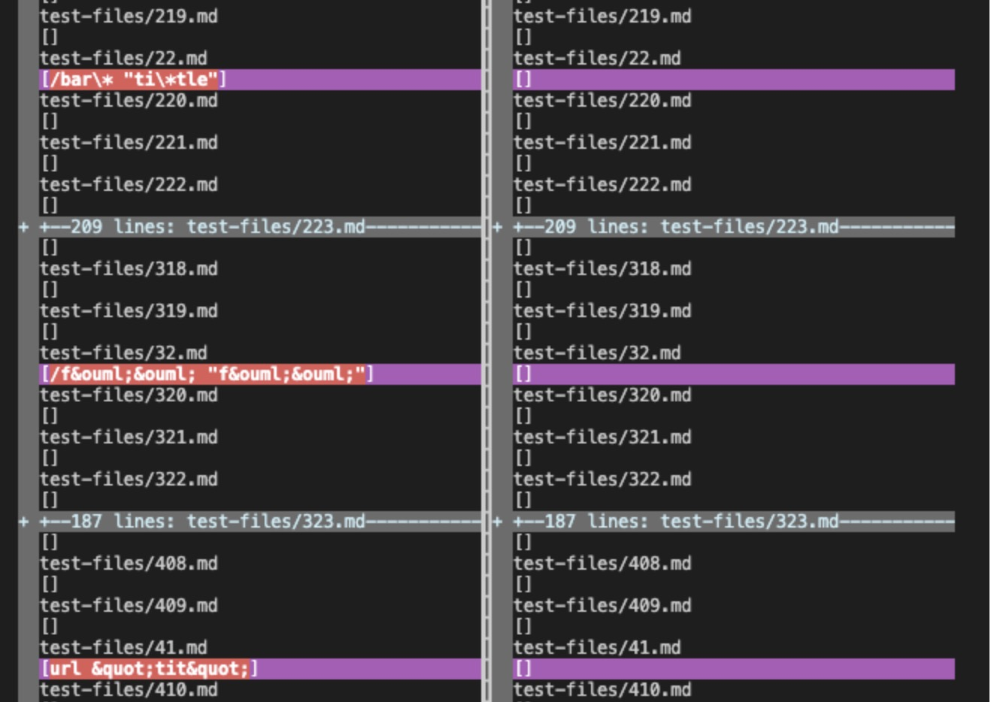

## Week 10 lab report
I chose two different tests that have a different output with my implementation and the course implementation. 

Through ```vimfiff``` command, I was able to find the tests that have different output. This has the following steps:
1. copied the outuput of running the course implementation onto a new file called ```result.txt```
2. then copied the output of my implementation into a new file called ```myresult.txt```
3. use ```vimfiff```, then we can comapre the two files 

this is my command:


this is the difference:
